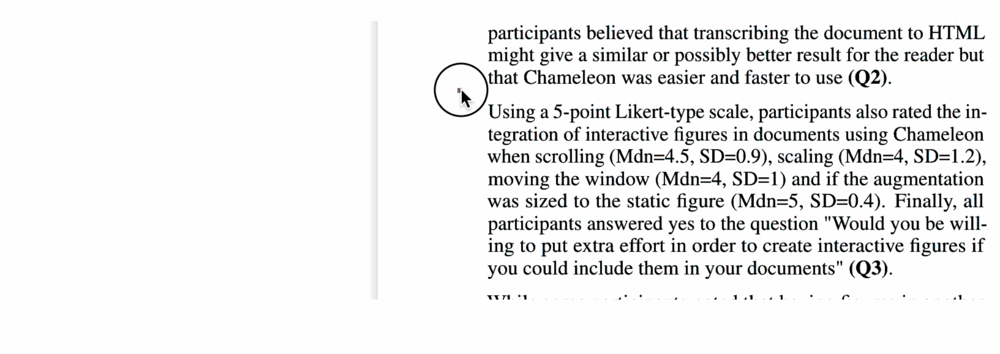

# Charagraph PDF Viewer
This repository contains the source code of a modified PDF Viewer that allows the creation of _Charagraphs_. Charagraphs are visualizations created from in-text numbers (see the [accompanying paper](https://hal.science/hal-04017629v1/file/Charagraph__CHI2023.pdf)). 

## [> Try the PDF Viewer online <](https://m-damien.github.io/Charagraph/home)


## Publication
> Damien Masson, Sylvain Malacria, Géry Casiez, and Daniel Vogel. 2023. Charagraph: Interactive Generation of Charts for Realtime Annotation of Data-Rich Paragraphs. In Proceedings of the 2023 CHI Conference on Human Factors in Computing Systems (CHI '23). Association for Computing Machinery, New York, NY, USA, Article 146, 1–18. 
[]( https://doi.org/10.1145/3544548.3581091)

## How to build & run
The tool was created using TypeScript and React. To run it, you can npm.
In the project directory, first install all dependencies:
```
npm install .
```

Then run the project:
```
npm start
```


## How to use

After selecting a paragraph that contains numbers, a popup will let you select different "group of values". Once one is selected, a charagraph is created. Charagraphs will appear in the margin, so make sure your web browser is in fullscreen/you are zoomed out enough to see the margins.
Note that the tool was tested and developped for recent versions of Google Chrome or Mozilla Firefox.


By default, it should load a PDF with pages extracted from various documents. Feel free to try the tool on different PDFs (CTRL/CMD+O)